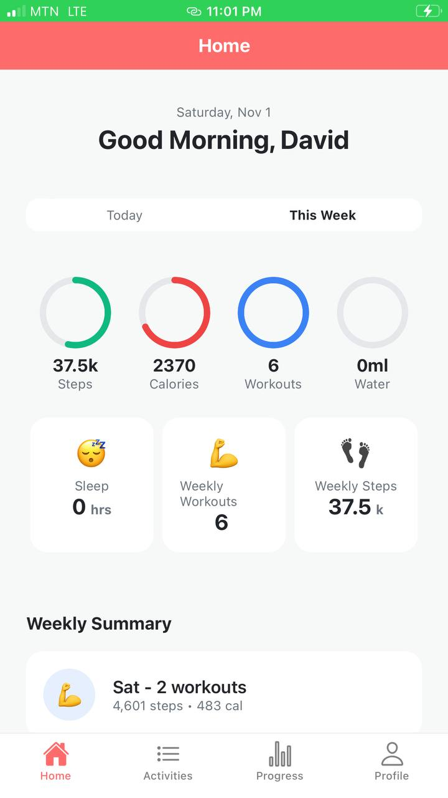
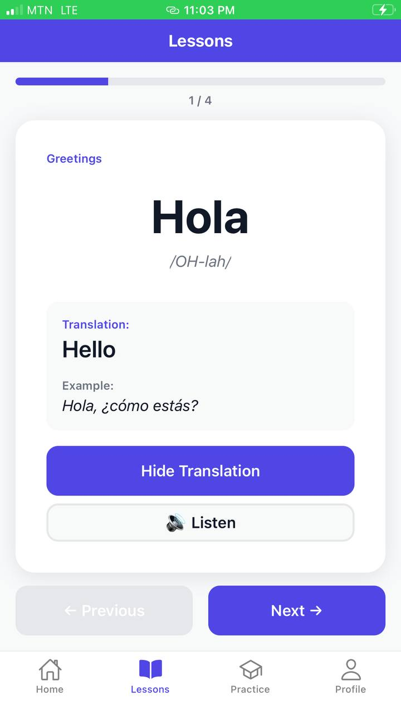
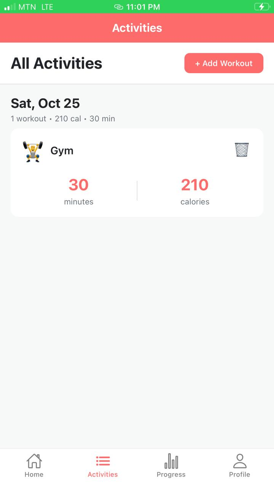
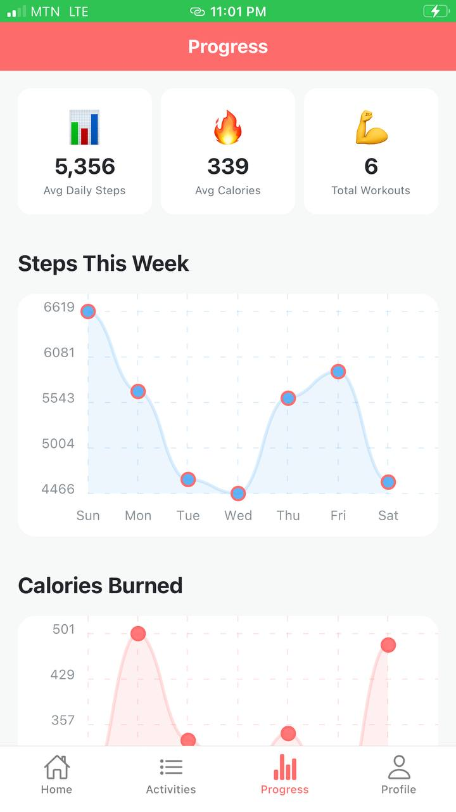

# 📱 React Native Apps Portfolio

A collection of three production-ready React Native applications demonstrating modern mobile development practices, AI integration, and best UI/UX patterns.

## 🎯 Projects Overview

| # | Project | Description | Tech Stack | Features |
|---|---------|-------------|------------|----------|
| 1 | [**Flashcard Quiz App**](./task-1-flashcard-quiz) | AI-powered learning app with equation support | React Native, TypeScript, Claude AI | AI Generation, Math Keyboard, Categories |
| 2 | [**FitTrack**](./task-3-fitness-tracker) | Complete language learning platform | React Native, TypeScript, Context API | Multi-language, Progress Tracking, Quizzes |
| 3 | [**LinguaLearn**](./task-4-language-learning) | Comprehensive fitness tracking solution | React Native, TypeScript, Chart Kit | Activity Tracking, Analytics, Goals |

---

## 🚀 Quick Start

### Prerequisites
```bash
- Node.js 16+ installed
- Expo CLI or React Native CLI
- iOS Simulator (Mac) or Android Emulator
- Git
```

### Clone Repository
```bash
git clone https://github.com/EyifaDavid/codealpha_tasks.git
cd codealpha_tasks
```

### Run Any Project
```bash
# Navigate to project folder
cd task-1-flashcard-quiz
cd FlashcardApp

# Install dependencies
npm install

# Start the app
npm start
```

---

## 📂 Project Details

### 1️⃣ Flashcard Quiz App
**[📖 Full Documentation](./task-1-flashcard-quiz/FlashcardApp/README.md)** | **[🎥 Demo](./assets/demos/flashcard-demo.gif)**


**Key Features:**
- 🤖 AI-powered flashcard generation (Claude API)
- 🧮 Math equation support with 40+ symbols
- 📁 Category management
- 💾 Local data persistence
- 🎨 Beautiful gradient UI

**Tech Highlights:**
- Anthropic Claude API integration
- Custom math symbol keyboard
- AsyncStorage for persistence
- TypeScript for type safety

---

### 2️⃣ LinguaLearn - Language Learning App
**[📖 Full Documentation](./task-4-language-learning/LanguageLearningApp/README.md)** | **[🎥 Demo](./assets/demos/lingua-demo.gif)**


**Key Features:**
- 🌍 8 language options
- 📚 Interactive flashcards with audio
- 🎯 Quiz system with instant feedback
- 📈 Progress tracking with streaks
- 🏆 Achievement system

**Tech Highlights:**
- Stack + Tab navigation
- Linear gradients
- Context API state management
- Responsive design

---

### 3️⃣ FitTrack - Fitness Tracker
**[📖 Full Documentation](./task-3-fitness-tracker/FitTrack/README.md)** | **[🎥 Demo](./assets/demos/fitness-demo.gif)**



**Key Features:**
- 📊 Beautiful charts (steps, calories, workouts)
- 💪 Manual activity logging
- 🎯 Goal tracking with progress bars
- 📅 Weekly analytics
- 🏃 8 workout types

**Tech Highlights:**
- React Native Chart Kit
- AsyncStorage persistence
- TypeScript interfaces
- Custom components

---

## 🛠️ Tech Stack

### Core Technologies
- **Framework:** React Native (Expo)
- **Language:** TypeScript
- **State Management:** Context API + Hooks
- **Navigation:** React Navigation (Stack + Tabs)
- **Storage:** AsyncStorage
- **API Integration:** Anthropic Claude API

### Key Libraries
- `@react-navigation/native` - Navigation
- `@react-navigation/bottom-tabs` - Tab navigation
- `react-native-chart-kit` - Data visualization
- `expo-linear-gradient` - Gradient backgrounds
- `react-native-dotenv` - Environment variables

---

## 📱 Screenshots

### Flashcard App
<p>
  
  
  
</p>

### LinguaLearn
<p>
  
  
  
</p>

### FitTrack
<p>
  
  
  
</p>

---

## 🎓 What I Learned

### React Native Fundamentals
- Component architecture and composition
- State management with Context API
- Navigation patterns (Stack + Tabs)
- Platform-specific code
- Performance optimization

### Advanced Features
- AI API integration (Claude)
- Custom keyboard implementation
- Chart visualization
- Data persistence strategies
- Error handling and validation

### Best Practices
- TypeScript for type safety
- Code organization and structure
- Reusable component design
- Environment variable management
- Git workflow and documentation

---

## 🚀 Deployment

### Build for Production

**iOS (Mac only):**
```bash
cd [project-folder]
eas build --platform ios
```

**Android:**
```bash
cd [project-folder]
eas build --platform android
```

**Web:**
```bash
cd [project-folder]
npm run web
```

---

## 📝 Environment Setup

Each project may require environment variables:

```bash
# Copy example file
cp .env.example .env

# Add your API keys

```

---

## 🤝 Contributing

Contributions are welcome! Please feel free to submit a Pull Request.

1. Fork the repository
2. Create your feature branch (`git checkout -b feature/AmazingFeature`)
3. Commit your changes (`git commit -m 'Add some AmazingFeature'`)
4. Push to the branch (`git push origin feature/AmazingFeature`)
5. Open a Pull Request

---

## 📄 License

This project is licensed under the MIT License - see the [LICENSE](LICENSE) file for details.

---

## 👤 Author

**Your Name**
- GitHub: [@EyifaDavid](https://github.com/EyifaDavid)
- LinkedIn: [David Eyifa](https://linkedin.com/in/davideyifa)
- Email: eyifadavidson@gmail.com@example.com

---

## 🙏 Acknowledgments

- [Expo](https://expo.dev/) - Amazing React Native framework
- [Anthropic](https://anthropic.com/) - Claude AI API
- [React Navigation](https://reactnavigation.org/) - Navigation library
- [React Native Chart Kit](https://github.com/indiespirit/react-native-chart-kit) - Charts

---

## 📚 Resources

- [React Native Documentation](https://reactnative.dev/)
- [Expo Documentation](https://docs.expo.dev/)
- [TypeScript Handbook](https://www.typescriptlang.org/docs/)
- [React Navigation Docs](https://reactnavigation.org/docs/getting-started)

---

**⭐ If you found these projects helpful, please consider giving them a star!**