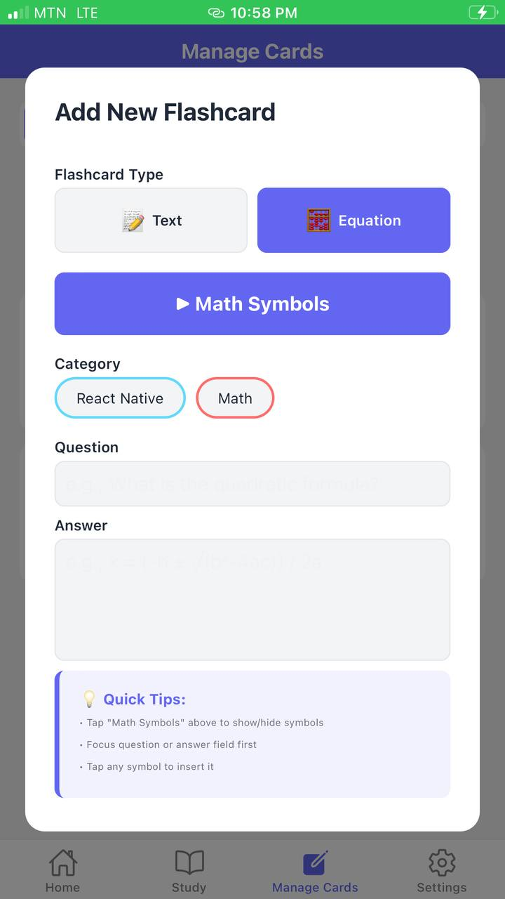

# 📚 Flashcard Quiz App

An AI-powered flashcard application with math equation support, built with React Native and TypeScript.

## 🎯 Features

### Core Functionality
- ✅ Create, edit, and delete flashcards
- ✅ Organize flashcards by categories
- ✅ Study mode with show/hide answers
- ✅ Navigate between cards
- ✅ Search and filter flashcards

### Advanced Features
- 🤖 **AI Generation** - Generate flashcards from any topic using Claude AI
- 🧮 **Math Equations** - Built-in math symbol keyboard with 40+ symbols
- 📁 **Categories** - Color-coded organization system
- 💾 **Persistence** - Data saved locally with AsyncStorage
- 🎨 **Beautiful UI** - Modern gradient design

## 🚀 Getting Started

### Prerequisites
```bash
Node.js 16+
npm or yarn
Expo CLI
```

### Installation
```bash
# Clone the repo
git clone https://github.com/EyifaDavid/codealpha_tasks.git

# Navigate to project
cd task-1-flashcard-quiz\FlashcardApp

# Install dependencies
npm install

# Install Expo dependencies
npx expo install @react-native-async-storage/async-storage expo-linear-gradient
```

### Setup API Key
```bash
# Install dotenv
npm install react-native-dotenv

# Create .env file
cp .env.example .env

# Add your Anthropic API key
echo "ANTHROPIC_API_KEY=sk-ant-api03-your-key-here" > .env
```

### Update babel.config.js
```javascript
module.exports = function(api) {
  api.cache(true);
  return {
    presets: ['babel-preset-expo'],
    plugins: [
      ['module:react-native-dotenv', {
        moduleName: '@env',
        path: '.env',
      }]
    ]
  };
};
```

### Run the App
```bash
# Start development server
npm start

# Run on iOS
npm run ios

# Run on Android
npm run android
```

## 📱 Screenshots

<p>
  
  
  
  
</p>

## 🎓 How to Use

### Creating Flashcards
1. Tap "Manage" tab
2. Tap "+ Add Card"
3. Select type (Text or Equation)
4. Choose category
5. Enter question and answer
6. For equations, use the math symbol keyboard
7. Tap "Add Flashcard"

### AI Generation
1. Tap "🤖 AI Generate"
2. Enter a topic (e.g., "Calculus")
3. Select number of cards (3, 5, or 10)
4. Choose difficulty level
5. Tap "Generate"
6. Wait 3-5 seconds for AI to create cards

### Using Math Keyboard
1. Select "Equation" flashcard type
2. Tap "▶ Math Symbols" to expand keyboard
3. Tap any symbol to insert it
4. Build equations like: x = (-b ± √(b²-4ac)) / 2a

### Studying
1. Tap "Study" tab
2. Read the question
3. Tap "Show Answer" to reveal
4. Use Previous/Next buttons to navigate

## 🛠️ Tech Stack

- **React Native** with Expo
- **TypeScript** for type safety
- **Context API** for state management
- **AsyncStorage** for data persistence
- **Anthropic Claude AI** for flashcard generation
- **React Navigation** (Stack + Bottom Tabs)

## 📦 Project Structure

```
01-flashcard-app/
├── App.tsx                    # Root component
├── .env                       # Environment variables (gitignored)
├── .env.example              # Example env file
├── babel.config.js           # Babel configuration
├── package.json              # Dependencies
├── tsconfig.json             # TypeScript config
│
└── src/
    ├── components/           # Reusable components
    │   ├── FlashCard.tsx
    │   └── FlashCardList.tsx
    │
    ├── screens/             # Screen components
    │   ├── HomeScreen.tsx
    │   ├── StudyScreen.tsx
    │   ├── ManageScreen.tsx  # With inline math keyboard
    │   └── SettingsScreen.tsx
    │
    ├── context/             # Global state
    │   └── FlashcardContext.tsx
    │
    ├── navigation/          # Navigation setup
    │   └── AppNavigator.tsx
    │
    ├── types/              # TypeScript types
    │   ├── index.ts
    │   └── env.d.ts
    │
    └── constants/          # App constants
        └── theme.ts
```

## 🔑 Environment Variables

```bash
# .env file
ANTHROPIC_API_KEY=sk-ant-api03-your-key-here"
```

Get your API key from: https://console.anthropic.com/settings/keys

## 🎨 Customization

### Add More Workout Types
Edit `src/constants/theme.ts`:
```typescript
export const WORKOUT_TYPES = [
  { id: 'boxing', name: 'Boxing', icon: '🥊', caloriesPerMin: 12 },
  // Add more here
];
```

## 🐛 Troubleshooting

### API Key Not Working
```bash
# Check .env file exists
ls -la .env

# Verify key format
cat .env | grep ANTHROPIC_API_KEY

# Restart with cache clear
npx expo start --clear
```

### Math Keyboard Not Showing
- Ensure "Equation" type is selected
- Check inline keyboard state
- Look for console errors
- Try toggling the keyboard button

### Build Errors
```bash
# Clear cache and reinstall
rm -rf node_modules
npm install
npx expo start --clear
```

## 📝 API Usage

### Generate Flashcards
```typescript
await generateFlashcardsFromTopic({
  topic: 'Quantum Physics',
  numberOfCards: 5,
  difficulty: 'medium'
});
```

### Cost Estimate
- Free $5 credit on signup
- ~$0.0015 per generation
- ~3,000+ generations with free credit

## 🚀 Deployment

### Build for iOS
```bash
eas build --platform ios
```

### Build for Android
```bash
eas build --platform android
```

### Deploy to Stores
```bash
eas submit --platform ios
eas submit --platform android
```

## 🤝 Contributing

Contributions welcome! Please open an issue first to discuss changes.

## 📄 License

MIT License - see [LICENSE](../LICENSE)

## 🔗 Links

- [Main Repository](../../)
- [LinguaLearn](../../task-4-language-learning/LanguageLearningApp/)
- [FitTrack](../../task-3-fitness-tracker/FitTrack/)

---

**Made with ❤️ using React Native**

